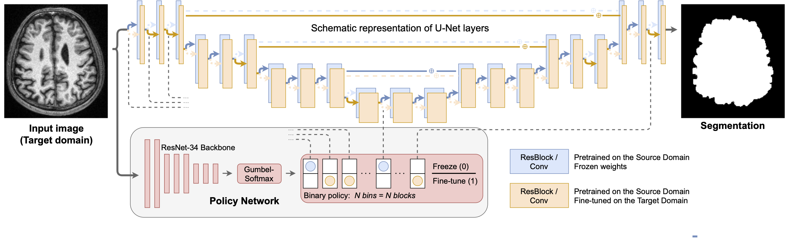

## Anatomy of Domain Shift Impact on U-Net Layers in MRI Segmentation

Hello! :vulcan_salute: This is our final project of the DL2021 course in Skoltech.

Below are the instructions, allowing for reproduction of the experiments.



### Setting up the Libraries:

###### 1. Install our `dl2021` module:
```
git clone https://github.com/BorisShirokikh/DL2021_Final_Project.git
cd DL2021_Final_Project
pip install -e .
``` 

###### 2. Install `surface-distance`:
```
git clone https://github.com/deepmind/surface-distance.git
pip install surface-distance/
```

Original repository: https://github.com/deepmind/surface-distance

There is a minor error in `surface_distance/metrics.py`:
the line `102` should be commented, please do it
(might be already fixed by the time you are reading this)

###### 3. Python & PyTorch versions we used:
1) Python: 3.8.5
2) torch: 1.8.1

to install PyTorch run:
```
conda install pytorch torchvision torchaudio cudatoolkit=10.2 -c pytorch
```

### Reproducing the Experiments (CC359)

1. The path to your local copy of CC359 should be specified here: `~/DL2021_Final_Project/configs/assets/dataset/cc359.config`. You should place `~/DL2021_Final_Project/configs/assets/dataset/meta.csv` in the same folder with the data. From the available in `CC359` ground truths we used the "Silver standard" binary mask (https://sites.google.com/view/calgary-campinas-dataset/download)

2. You should specify the 'device' on which you are going to run an experiment by setting the corresponding variable 'device', in `~/DL2021_Final_Project/configs/assets/core.config` (line 78)

3. To run a single experiment, please follow the steps below:

First, the experiment structure should be created:
```
dpipe-build ~/DL2021_Final_Project/path/to/the/config.config /path/to/the/experiment/
# e.g.
dpipe-build ~/DL2021_Final_Project/configs/experiments/finetune/unfreeze_first.config ~/dart_results/unfreeze_first
```

where the first argument is the path to the `.config` file and the second argument is the path to the folder where the experiment structure will be organized.

Then, to run an experiment please go to the experiment folder inside the created structure (`i` corresponds to the particular experiment, i.e. to the particular source-target pair):
```
cd ~/dart_results/unfreeze_first/experiment_{i} 
```

and call the following command to start the experiment:

```
dpipe-run ../resources.config
```

where `resources.config` is the general `.config` file of the experiment.

4. First, you should run `one2all` baseline. The models trained are utilized in the dowstream fine-tuning experiments. 
You should specify the folder, where these models are stored in the `baseline_exp_path` variable, which is present in each downstream experiment config. 


### Guide to run the Experiments (WMH)

###### 1. Paths (neuro)
- path to WMH data: `/nmnt/x3-hdd/data/da_mri/wmh_ants/`
- **path to experiments**: `/nmnt/x4-hdd/experiments/da_exps/`

Do not forget to use `chmod -R 770 [DIR]` and `chown -R [USER]:trusted [DIR]` to share
permissions to write for the other users.

###### 2. Build-run an experiment

To build and instantly run the experiment use
```
build_run [CONFIG] [EXP_PATH]
```

Example:
```
build_run ~/DL2021_Final_Project/configs/experiments/baseline_wmh/one2all.config /nmnt/x4-hdd/experiments/da_exps/test/
```

You can pass additional options that could be useful:
- `-max [N]` restrict the maximum number of simultaneously running jobs to N.
- `-g [N]` number of GPUs to use. 0 for CPU computations (could be useful
to debug an exp while all GPUs are unavailable), additionally you should set
 `device='cpu'` in config. (1 is default and utilizes GPU.)

###### 3. Separately build and run an experiment

Actually, `build_run` executes 2 following commands: `dpipe-build` and `qexp`

1. In case, if you want to build tons of experiments, then submit them with `-max`
restriction, you use `dpipe-build` until you done:) then use `qexp` on the top
directory of all previously built experiments.

2. In case, if your experiment has been crashed because of bug in the code, you
could just fix the code and re-submit experiment with `qexp`. Probably you also
need to delete `.lock` file in the experiment folder.
(bug in the code, not config, otherwise you should rebuild experiment)

They have similar syntax:

```
dpipe-build [CONFIG] [EXP_PATH] [OPTIONS: {-g, -max}]
qexp [EXP_PATH] [OPTIONS: {-g, -max}]
```

###### 4. Debugging

All logs are being saved in `~/.cache/cluster-utils/logs`, just `cat` it!

Validation scores, train losses and time profiles could be visualized via `tensorboard`.
```
tensorboard --logdir /nmnt/x4-hdd/experiments/da_exps/ --port=6067
```

###### 5. Working with the remote server

Assuming you've run jupyter (or tensorboard) on the remote server (e.g. `neuro-x5`)
```
jupyter-notebook --no-browser --port=8611
```
Open a terminal on your computer and run
```
ssh -L localhost:8611:localhost:8611 -N neuro-x5
```
Now, if you enter `localhost:8611` in your browser, the jupyter running on the
`neuro-x5` will be opened.

Furthermore, if you want to run PyCharm to modify remote files, you need:

1. `mkdir ~/neuro-xx` (create directory only once)
2. `sshfs neuro-x1: ~/neuro-xx` (mounts home directory from remote server into your local folder)
3. (now you can edit files from remote server via your favorite IDE, etc.)
4. When finished, use `sudo umount ~/neuro-xx`
